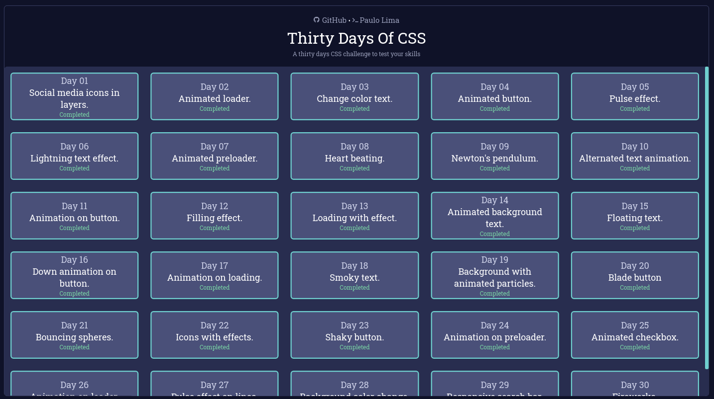

# 🖥️ Thirty Days Of CSS Template

<h1 align="center">
  
</h1>

## 🔎️ Description

The Thirty days of CSS is a challenge that aims to help you improve your coding skills by doing mini daily projects using HTML5 and CSS3. In my case, I have decied to create a React.js application to serve as a base to all the challanges.

You can use this template project as a starting point to solve the challenges by yourself.

## 👀️ Rules

- Finish one challenge a day.
- Share your progress on social media (Twitter, Facebook, Linkedin etc.) using the hashtag #30DaysOfCSS

## 🛠️ Cloning and Running the project

- Click on `Use this template` button
- Create a new repository based on this template
- Clone the new repository into your local machine
- On the newly cloned project folder, run `yarn` to install all dependencies
- After all the dependencies are successfully installed, run `yarn start` to start the project

## 🔌️ Solving a challenge

- On `src/components/challenges/` there is a folder called **Day-Template** which contains a template with the necessary file structure to start to solve a new challenge. Copy and paste this folder on the same directory and change the folder name to `Day[CHALLENGE NUMBER]`. Ex: 'Day01'.
- Now you can use `index.tsx` and `styles.css` files on the **Challenge** folder to solve your challenge.
- Once you finish your challenge, for everything to look nice, copy all the content of your CSS file and paste it into the `CSS_CODE` string constant at the index file of `Code` folder.

## 🔥️ Tips

- On the folder `src/assets/challenges/` there is a file called **challengesList.json** which contains a list with all challenges. You will notice that the property `isFinished` is responsible to show a challenge as available/unavailable. You can set this property as true when once you finish it in order to make it visible.
- You can use pure CSS or Styled Components to solve you challenge, but it is recommended to use pure CSS, since this is the main goal of the challenge. Styled Components was only added into this project in order to facilitate the creation of the other componenents.
- If you are using pure CSS, be careful while writing your code, they can easly override other challenges styles, which is not optimal. To solve this simply add a unique class names or id to each element of each challenge and reference them in you CSS code.
- You do not need to worry about creating styles for the containers for both Challenges or Code sections.
- Once you create a new copy of a challenge template, you can see that there is already a default style for the challenge container. If you need to modify that just add a comment at the code informing wath has changed.
- You can access a challenge by adding `/challenges/day-[CHALLENGE NUMBER]` at the end of the URL. Ex: `/challenges/day-01`.
- If you want to check my solutions click **<a href="https://github.com/PauloPHLP/ThirtyDaysOfCSS" target="__blank">here</a>** and you will be able to check my codes and also see all results live.

## 🚀️ Technologies

- HTML5
- CSS3
- React.js
- TypeScript
- Yarn

---

I was inspired by **<a href="https://github.com/MilenaCarecho/30diasDeCSS" target="__blank">Milena Carecho</a>** to face this challenge. Check out her work!

Thank you and good coding 😎️

Made by **<a href="https://paulophlp.github.io/portfolio/" target="__blank">Paulo Lima 🤓️</a>**
